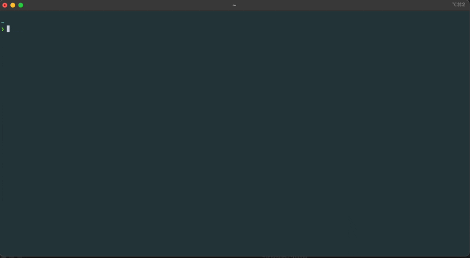

# docker-repack - Optimize Docker images for pulling speed.

This tool repacks Docker images into smaller, more efficient images. This significantly reduces the time it takes to
pull an image. Some examples:

| Image                                                                           | Before                       | After             | Reduction                 |
|---------------------------------------------------------------------------------|------------------------------|-------------------|---------------------------|
| [google/deepsomatic](https://registry.hub.docker.com/r/google/deepsomatic/tags) | 16.4GB, 2 minutes 14 seconds | 4.8GB, 16 seconds | 3.4x smaller, 8.2x faster |
| [google/deepvariant](https://hub.docker.com/r/google/deepvariant/tags)          | 12.7GB, 1 minute, 2 seconds  | 3GB, 10 seconds   | 6.3x faster, 4.2x smaller |
| [google/cloud-sdk](https://registry.hub.docker.com/r/google/cloud-sdk/tags)     | 1.1GB, 5 seconds             | 187MB, 1 second   | 3.8x faster, 6.1x smaller |
| [mathworks/matlab](https://hub.docker.com/r/mathworks/matlab/tags)              | 2GB, 5 seconds               | 230.7MB, 1 second | 6.5x faster, 9x smaller   |
| [tensorflow/tensorflow](https://hub.docker.com/r/tensorflow/tensorflow/tags)    | 3.5GB, 11 seconds            | 2GB, 3 seconds    | 3.3x faster, 1.8x smaller |

See the [benchmarks page](https://orf.github.io/docker-repack/benchmarks/) for a full comparison of pulling times across
many different images.

For more information on how the tool works, see the [about page](docs/about.md).



## Usage

```bash
$ docker-repack docker://alpine:latest oci://directory/ --target-size=50MB
```

## Installation

### Pre-compiled binaries

Download a release [from the releases page](https://github.com/orf/docker-repack/releases)

### Cargo

```bash
cargo install docker-repack
````

